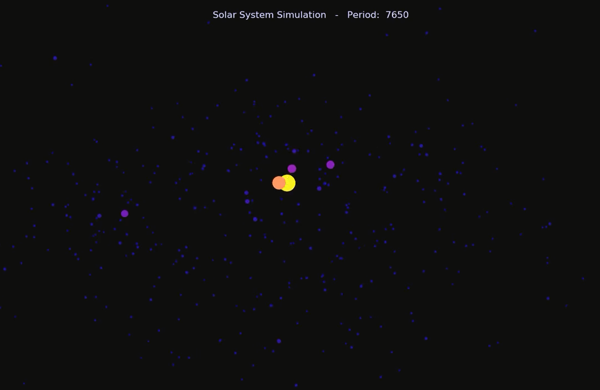

# solar_system

solar_system Python project that models how a solar system forms in 3D.  Many particles are initially created and then allowed to move under the force of gravity.

  - Example Run
    ```sh
    SolarSim(TOTAL_TIME=50000, INITIAL_SPACEBODIES=5000, ANIMATION_INTERVAL=50, FRAME_SAMPLE_RATE=15)
    ```
    


License
----
TODO
